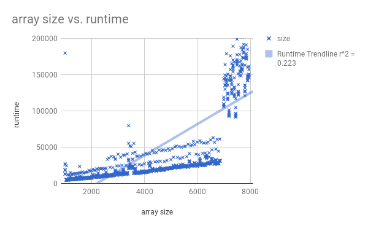

# weLoveIceCream
 Shafali Gupta, James Huang, Kevin Feng
 Lab 00
 2018-02-09
### Hypothesis:
 For an  n*n matrix, the worst execution time for our search mathod is O(n)
### Background:
 This project is to figure out if it is possible to search a matrix in O(n) runtime.  The matrix is populated and sorted by row and column so that there is a worst case scenario. Everytime you go down or across from one unit, the next number will always be bigger.
### Experiment Methodology:
 In this experiment, we ran through the matrix searching for the worst case senario. The worst case is if the value is at the bottom left of the matrix. We found out how much time it took to run multiple matrixes of different sizes, ranging from 1000*1000 and 8000*8000. Then we graphed the time in nanoseconds.

### Results:

### Conclusions:
 As the graph shows, it is a linear runtime, but only uptop a certain point. After that it is not linear in corresponding to the smaller matrixes. So overall it is not a O(n) algorithm, but the runtime can be O(n) if the data size is small enough. Something we cannot explain is the huge spike in the data and why there is a change in the trend as the data size gets larger. 
